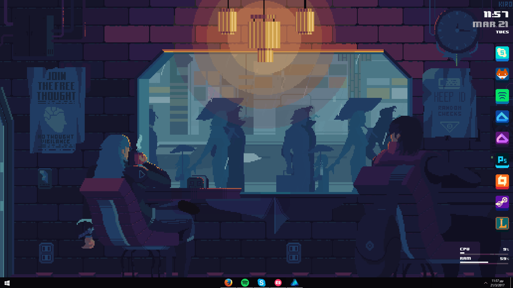

  

## 👋 Hey! Welcome to my profile

  

I'm a Systems and Electronic Engineering student, developing tools to automate processes and diving deep into the world of cybersecurity. 

### 👨‍💻 About me

* 🎓 Currently studying **Systems and Electronic Engineering**.
* 💻 Passionate about **Cybersecurity**, **Software Development** (Python, React, Flask), and **Automation**.
* ⚙️ Building algorithmic trading bots (MT5) and developing robust management systems.
* 🐧 Enthusiast of hardware optimization, virtualization, and Linux environments.

### 🛠️ Tech Stack & Tools

  
  
  
  

### 📊 GitHub Stats

