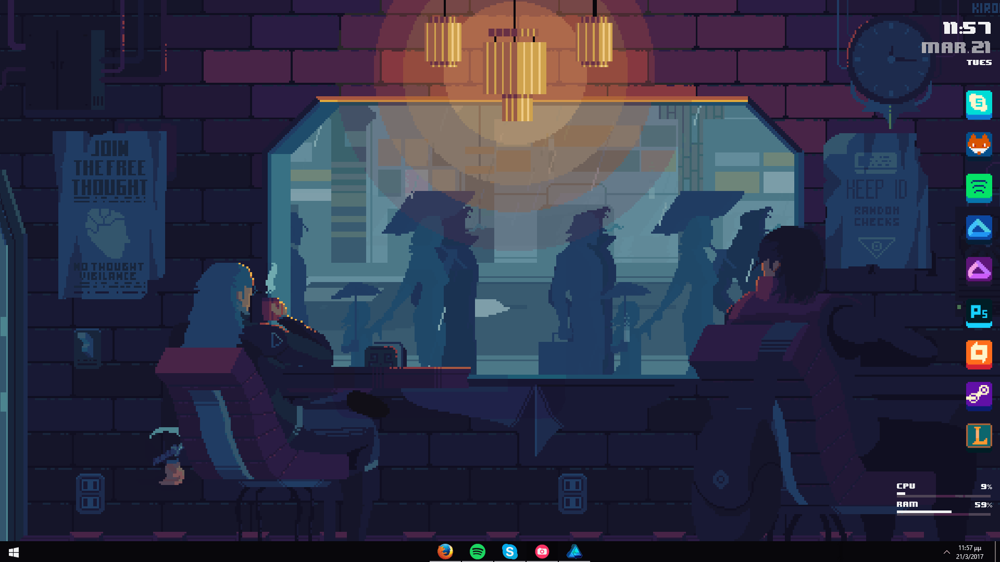

  

👋 **Hey! Welcome to my profile**

*   🛡️ **Systems Engineering Senior Student** specializing in **Fullstack Development** and **DevOps**.
*   💻 Proficient in building scalable applications with **React, TypeScript, Go,** and **Python**.
*   ⚙️ Experienced in creating automated **n8n workflows** and managing **Docker-based infrastructure**.
*   🐧 Enthusiastic about **Linux administration** (Ubuntu/Debian) and **cybersecurity fundamentals**.
*   🔍 Currently seeking opportunities as a **Junior Developer or Intern** to grow my skills and deliver value.

🛠 **Tech Stack & Tools**
<!-- Mantén tus badges actuales: Python, React, Flask, Linux, etc. -->

  
  
  
  

### 📊 GitHub Stats

